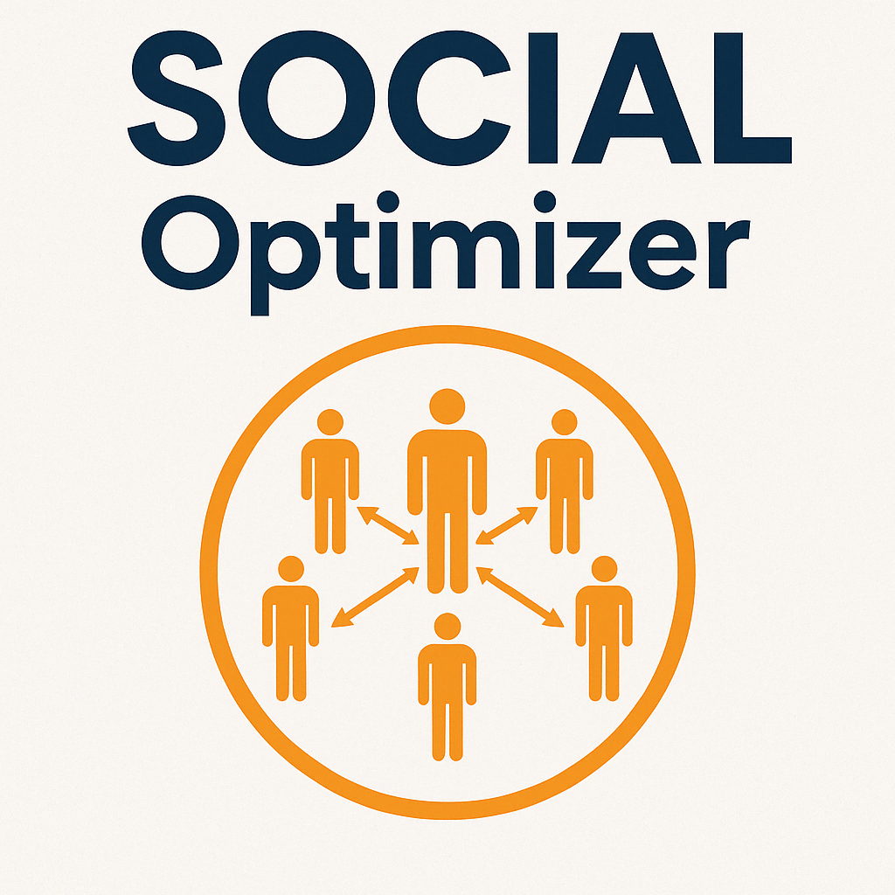

  

#  SOCIAL: Social Network Optimization Algorithm via Centrality and Influence-based Learning
**SOCIAL** is a novel population-based optimization algorithm inspired by human social behaviors, adaptive learning, and collective intelligence. It combines elite memory, dynamic mutation, and diffusion-based learning to solve complex, multimodal optimization problems with efficiency and stability.

---

  

## 🌐 SOCIAL: Social Network Optimization Algorithm via Centrality and Influence-based Learning

**SOCIAL** is a network-driven optimization algorithm that models agent behavior as information-sharing over an adaptive graph. Designed for complex, multimodal, and high-dimensional optimization tasks, it leverages centrality, influence, and dynamic mutation to explore and exploit the solution space.

---

### 🔁 Algorithm Workflow

1. **Initialize the Agent Network**
   - Generate a graph (e.g., Watts-Strogatz, Barabási–Albert) with `NUM_NODES` agents.
   - Each node is assigned a random position in the solution space.

2. **Evaluate Fitness**
   - Compute the fitness of all agents using a selected benchmark or objective function.
   - Identify the current best solution (global best and elite).

3. **Main Optimization Loop**
   Repeats for `ITERATIONS`:

   - **Social Diffusion Update**
     - Each agent updates its position using:
       - Weighted influence from neighbors (based on centrality & performance)
       - Global best and elite solutions
       - Synchronization with population mean
     - Adaptive mutation is applied based on entropy and fitness diversity.

   - **Elite Pulling (Formerly "Lotus Shrink")**
     - Top agents are gradually pulled toward the elite solution with decaying influence.

   - **Community-Guided Local Search (CGLS, formerly "Lotus Reinforcement")**
     - Underperforming agents adjust their positions based on local community leaders and direction vectors.
     - Helps refine solutions in a decentralized, structure-aware way.

   - **Graph Adaptation**
     - Periodically:
       - Remove low-fitness agents and replace them with new ones.
       - Rewire edges to strengthen good neighborhoods and ensure diversity.
       - Add random links to preserve exploration.

4. **Run Statistics & Evaluation**
   - Save convergence history, fitness curves, and final populations.
   - Repeat for `NUM_RUNS` to collect robustness and diversity metrics.

---

### 🧪 Highlights

- Graph-native agent modeling
- Centrality- and influence-weighted interactions
- Adaptive mutation using population entropy
- Community-based local exploitation
- Elite tracking and guided attraction
- Compatible with continuous, discrete, and mixed-type problems

---

### 📊 Benchmark Support

Functions included:
- Unimodal: Sphere, Rosenbrock, Step, etc.
- Multimodal: Rastrigin, Ackley, Griewank, Schwefel variants
- Deceptive: Shekel, Hartman, Branin, etc.

---

