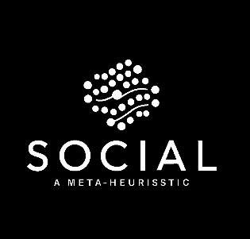

<p align="center">
  
</p>


# 🤝 SOCIAL: Social-Inspired Collective Adaptive Intelligence Learning

**SOCIAL** is a novel population-based optimization algorithm inspired by human social behaviors, adaptive learning, and collective intelligence. It combines elite memory, dynamic mutation, and diffusion-based learning to solve complex, multimodal optimization problems with efficiency and stability.

---

## 🚀 Key Features

- **Elite Memory**: Maintains top individuals to guide the search.
- **Dynamic Mutation**: Adjusts mutation intensity across iterations.
- **Social Diffusion**: Knowledge sharing influenced by fitness and centrality.
- **Multi-Phase Strategy**: Shifts from exploration to exploitation.
- **Scalable & Versatile**: Effective for both benchmark and real-world problems.

---

## 📈 Applications

- Global optimization problems  
- Hyperparameter tuning in machine learning  
- Feature selection  
- Engineering design  
- Materials science and cheminformatics

---

## 📊 Benchmark Performance

SOCIAL has been tested on 23 standard benchmark functions and compared with state-of-the-art optimizers using:

- Best and average fitness  
- Success rate  
- Robustness  
- Convergence speed  
- Population diversity

---

## 📦 Installation

Clone the repository:

```bash
git clone https://github.com/YourUsername/SOCIAL.git
cd SOCIAL
